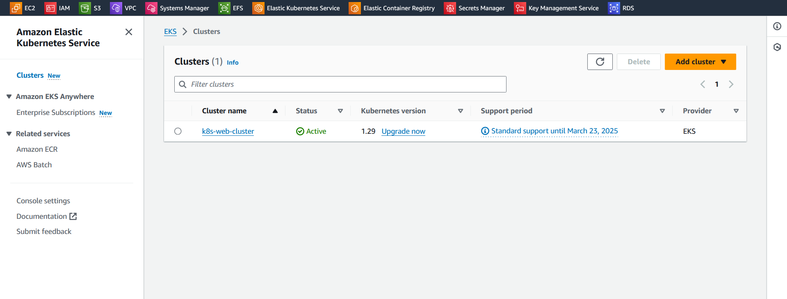
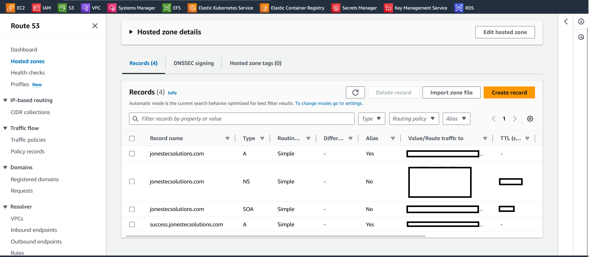

# Deployment Of A Four Tier Appication in Kubernestes
## Overview
This project seeks to deploy a web app which hosts a web CV and Portfolio. The Website is linked to an external RDS managed by AWS. The project utilise AWS Elastic Kubernetes services to orchestrate the containers which were containerised with `Docker`. The AWS EKS and the MySQL RDS resources were deployed and managed by `Terraform`. 

## Project application Stack 
- Terraform: For Infrastructure as Code (IaC)
- Docker: For dockerising web applications
- Kubernestes (AWS EKS): For container orchestration
- Git and GitHub: For source code control
### Create An Amazon Elastic Kubernetes Services (EKS) Cluster
**Terraform** is utilised to build and managed AWS resources for this project. The `Amazon Elastic Kubernetes Service (EKS)` and `MySQL` relational datatbase service come with a cost and managing the build and tear-down with Terraform helps to reduce cost. <p> 
To allow the AWS EKS to create AWS resources on my behalf, I need to create an `IAM role` that EKS can assume. The IAM is also configured in the Terraform set up below:

1. **Create an IAM Role**: 
Create a file locally called trust.json in my project working directory with the following policy:

```
{
  "Version": "2012-10-17",
  "Statement": [
    {
      "Effect": "Allow",
      "Principal": {
        "Service": "eks.amazonaws.com"
      },
      "Action": "sts:AssumeRole"
    }
  ]
}
```
### Setup Terraform Configurations 🚀🔍
1. Provider.tf
```
terraform {
  required_providers {
    aws = {
      source  = "hashicorp/aws"
      version = "~> 5.0"
    }
  }
}

# Configure the AWS Provider
provider "aws" {
  region = "eu-west-1"
}
```
2. data.tf
```
data "aws_iam_policy_document" "assume_role" {
  statement {
    effect = "Allow"

    principals {
      type        = "Service"
      identifiers = ["eks.amazonaws.com"]
    }

    actions = ["sts:AssumeRole"]
  }
}

#get vpc data
data "aws_vpc" "default" {
  default = true
}
#get public subnets for cluster
data "aws_subnets" "public" {
  filter {
    name   = "vpc-id"
    values = [data.aws_vpc.default.id]
  }
}

#get public subnets for cluster
data "aws_subnets" "private" {
  filter {
    name   = "vpc-id"
    values = [data.aws_vpc.default.id]
  }
}

# Fetch a single subnet
data "aws_subnet" "public_selected" {
  id = "subnet-88888888888888888"        
}

# Fetch ami from canonical 
data "aws_ami" "ubuntu_latest" {
  most_recent = true
  owners      = ["099720109477"] # Canonical

  filter {
    name   = "name"
    values = ["ubuntu/images/hvm-ssd/ubuntu-focal-20.04-amd64-server-*"]
  }

  filter {
    name   = "virtualization-type"
    values = ["hvm"]
  }
}

data "aws_key_pair" "instance_connect_keypair" {
  key_name = "Addkeypair"
}
```
3. local.tf
```
locals {
  name             = format("%s-%s", var.name, "vpc")
  short_region     = "euw1"
  resource_name    = format("%s-%s", var.name, local.short_region)
  aws_ssm_username = format("/%s/%s/%s", var.name, local.short_region, "username")
  aws_ssm_password = format("/%s/%s/%s", var.name, local.short_region, "password")
  aws_ssm_endpoint = format("/%s/%s/%s", var.name, local.short_region, "endpoint")
}
```

4. variables.tf
```
# Variables configirations 
# The following are the default values for the configuration variables in main.tf and ssm.tf
# Variables configirations 
# The following are the default values for the configuration variables

# Variables configirations 
# The following are the default values for the configuration variables

# Variables definitions for EKS
variable "name" {
  type        = string
  description = "name for resources"
  default     = "<Nameforresources>"
}

variable "eks_instance_type" {
  type        = list(string)
  description = "Types of EC2 Instances for different purposes"
  default     = ["t2.medium"]
}


variable "ec2_scaling" {
  type        = list(number)
  description = "Number of EC2 instances to run in the EKS cluster"
  default     = [3, 5]
}

# Variables for ECR 
variable "muta" {
  type        = string
  description = "The tag mutability setting for the repository"
  default     = "MUTABLE"
}

variable "scan" {
  type        = bool
  description = "Indicates whether images are scanned after push"
  default     = true
}

# Variables description for RDS
variable "db_name" {
  type        = string
  description = "Name of the RDS database"
  default     = "<your-db-name>"
}

variable "storage" {
  type        = number
  description = "Storage size for RDS database"
  default     = 20
}

variable "engine" {
  type        = string
  description = "Database engine"
  default     = "mysql"
}

variable "engine_version" {
  type        = string
  description = "Database engine version"
  default     = "8.0"
}

variable "instance_class" {
  type        = string
  description = "Instance class for RDS database"
  default     = "db.t3.micro"
}

variable "db_username" {
  type        = string
  description = "Username for RDS database"
  default     = "AddyourDBusername"
}

variable "override" {
  type        = string
  description = "Password for RDS database"
  default     = "<yourDBpassword"
}

variable "length" {
  description = "Length of the resource."
  type        = number
  default     = 16
}

variable "special" {
  description = "Whether to include special characters."
  type        = bool
  default     = true
}


variable "parameter_group_name" {
  type        = string
  description = "Parameter group name for RDS database"
  default     = "default.mysql8.0"
}

variable "skip_final_snapshot" {
  type        = bool
  description = "Skip final snapshot"
  default     = true
}

variable "access_db" {
  type        = bool
  description = "Access to database"
  default     = true
}

# variables for RDS Security Group CIDR Blocks 
variable "eks_node_cidr_blocks" {
  type        = list(string)
  description = "CIDR blocks for EKS nodes"
  default     = ["add Cidr blocks from the EKS Nodes"]
}

variable "ssh_cidr" {
  type        = list(string)
  description = "CIDR block for your IP address"
  default     = ["<addyourIPAddresshere/32"]
}

# variables for EC2 Instance Connect
variable "storage_type" {
  type        = string
  description = "Storage type for EC2 DB Instance Connect"
  default     = "gp2"
}

variable "db_instance_type" {
  type        = string
  description = "Types of EC2 Instances for different purposes"
  default     = "t2.micro"
}

variable "os" {
  type        = string
  description = "Operating System for EC2 DB Instance Connect"
  default     = "ubuntu"
}
```
5. main.tf
```
# Resources configirations 
# The following are the configurations for Terraform to create resources in AWS

##########################################################################################################################
################################################   EKS Resources   #######################################################
##########################################################################################################################

# create the IAM role for EKS
resource "aws_iam_role" "myk8s_role" {
  name               = "Myk8sRole"
  assume_role_policy = data.aws_iam_policy_document.assume_role.json
}

# Attach the EKS service policy to the role
resource "aws_iam_role_policy_attachment" "myk8s-AmazonEKSClusterPolicy" {
  policy_arn = "arn:aws:iam::aws:policy/AmazonEKSClusterPolicy"
  role       = aws_iam_role.myk8s_role.name
}

#cluster provision
resource "aws_eks_cluster" "mywebsite_cluster" {
  name     = "k8s-web-cluster"
  role_arn = aws_iam_role.myk8s_role.arn

  vpc_config {
    subnet_ids = data.aws_subnets.public.ids
  }

  # Ensure that IAM Role permissions are created before and deleted after EKS Cluster handling.
  # Otherwise, EKS will not be able to properly delete EKS managed EC2 infrastructure such as Security Groups.
  depends_on = [
    aws_iam_role_policy_attachment.myk8s-AmazonEKSClusterPolicy,
  ]
}

# Create Node Grroup
resource "aws_iam_role" "myk8s-node" {
  name = "myk8s-node-group-cloud"

  assume_role_policy = jsonencode({
    Statement = [{
      Action = "sts:AssumeRole"
      Effect = "Allow"
      Principal = {
        Service = "ec2.amazonaws.com"
      }
    }]
    Version = "2012-10-17"
  })
}

# Attach Policies
resource "aws_iam_role_policy_attachment" "myk8sNode-AmazonEKSWorkerNodePolicy" {
  policy_arn = "arn:aws:iam::aws:policy/AmazonEKSWorkerNodePolicy"
  role       = aws_iam_role.myk8s-node.name
}

resource "aws_iam_role_policy_attachment" "myk8sCNI-AmazonEKS_CNI_Policy" {
  policy_arn = "arn:aws:iam::aws:policy/AmazonEKS_CNI_Policy"
  role       = aws_iam_role.myk8s-node.name
}

resource "aws_iam_role_policy_attachment" "myk8sECR-AmazonEC2ContainerRegistryReadOnly" {
  policy_arn = "arn:aws:iam::aws:policy/AmazonEC2ContainerRegistryReadOnly"
  role       = aws_iam_role.myk8s-node.name
}

# create node group
resource "aws_eks_node_group" "myk8s_node_grp" {
  cluster_name    = aws_eks_cluster.mywebsite_cluster.name
  node_group_name = "k8s-website_Node-cloud"
  node_role_arn   = aws_iam_role.myk8s-node.arn
  subnet_ids      = data.aws_subnets.public.ids

  scaling_config {
    desired_size = var.ec2_scaling[0]
    max_size     = var.ec2_scaling[1]
    min_size     = var.ec2_scaling[0]
  }
  instance_types = var.eks_instance_type

  # Ensure that IAM Role permissions are created before and deleted after EKS Node Group handling.
  # Otherwise, EKS will not be able to properly delete EC2 Instances and Elastic Network Interfaces.
  depends_on = [
    aws_iam_role_policy_attachment.myk8sNode-AmazonEKSWorkerNodePolicy,
    aws_iam_role_policy_attachment.myk8sCNI-AmazonEKS_CNI_Policy,
    aws_iam_role_policy_attachment.myk8sECR-AmazonEC2ContainerRegistryReadOnly,
  ]
}

##########################################################################################################################
################################################   ECR Resources   #######################################################
##########################################################################################################################

# Create Elastic Container Registry Repo 
resource "aws_ecr_repository" "my_ecr" {
  name                 = "${var.name}-ecr"
  image_tag_mutability = var.muta

  image_scanning_configuration {
    scan_on_push = var.scan
  }
}

##########################################################################################################################
######################################################## RDS #############################################################
##########################################################################################################################

# RDS Subnet Group
resource "aws_db_subnet_group" "private_db_subnet" {
  name        = "mysql-rds-private-subnet-group"
  description = "Private subnets for RDS instance"
  subnet_ids  = data.aws_subnets.private.ids
}

# RDS Security Group
resource "aws_security_group" "rds_sg" {
  name        = "${var.db_name}-rds-sg"
  description = "Allow inbound/outbound MySQL traffic"
  vpc_id      = data.aws_vpc.default.id
  depends_on  = [data.aws_vpc.default]
}

# Allow inbound MySQL connections from EKS Node Groups
resource "aws_security_group_rule" "allow_mysql_in" {
  description              = "Allow inbound MySQL connections"
  type                     = "ingress"
  from_port                = "3306"
  to_port                  = "3306"
  protocol                 = "tcp"
  source_security_group_id = aws_security_group.rds_sg.id
  security_group_id        = aws_security_group.rds_sg.id
}

# Allow inbound MySQL connections from my IP
resource "aws_security_group_rule" "allow_mysql_in_my_ip" {
  description       = "Allow inbound MySQL connections from my IP"
  type              = "ingress"
  from_port         = 3306
  to_port           = 3306
  protocol          = "tcp"
  cidr_blocks       = var.ssh_cidr
  security_group_id = aws_security_group.rds_sg.id
}

# Allow inbound MySQL connections from EKS Node Groups
resource "aws_security_group_rule" "allow_ec2_in_mysql_db" {
  description              = "Allow inbound MySQL connections"
  type                     = "ingress"
  from_port                = "3306"
  to_port                  = "3306"
  protocol                 = "tcp"
  source_security_group_id = aws_security_group.instance_connect_sg.id
  security_group_id        = aws_security_group.rds_sg.id
}

resource "random_password" "password" {
  length           = var.length
  special          = var.special
  override_special = var.override
}

resource "aws_db_instance" "mydb" {
  identifier           = var.name
  allocated_storage    = var.storage
  db_name              = var.name
  engine               = var.engine
  engine_version       = var.engine_version
  instance_class       = var.instance_class
  username             = aws_ssm_parameter.db_username.value
  password             = aws_ssm_parameter.db_password.value
  parameter_group_name = var.parameter_group_name
  skip_final_snapshot  = var.skip_final_snapshot
  publicly_accessible  = var.access_db

  # Associate RDS with the subnet group
  db_subnet_group_name = aws_db_subnet_group.private_db_subnet.name

  # Use the security group associated with EC2 instances
  vpc_security_group_ids = [aws_security_group.rds_sg.id]

  tags = {
    Name = "${var.name}-instance"
  }

}

##########################################################################################################################
############################################# EC2 Instance Connnect #######################################################
##########################################################################################################################

resource "aws_security_group" "instance_connect_sg" {
  name        = "${var.name}-instance-connect-sg"
  description = "Default security group to allow inbound/outbound from the VPC"
  vpc_id      = data.aws_vpc.default.id
  depends_on  = [data.aws_vpc.default]
}

# Allow inbound SSH for EC2 instances
resource "aws_security_group_rule" "allow_ssh_in" {
  description       = "Allow SSH"
  type              = "ingress"
  from_port         = 22
  to_port           = 22
  protocol          = "tcp"
  cidr_blocks       = var.ssh_cidr
  security_group_id = aws_security_group.instance_connect_sg.id
}

resource "aws_security_group_rule" "allow_https_in_api" {
  description       = "Allow inbound HTTPS traffic from my ip"
  type              = "ingress"
  from_port         = 443
  to_port           = 443
  protocol          = "tcp"
  cidr_blocks       = var.ssh_cidr
  security_group_id = aws_security_group.instance_connect_sg.id
}

resource "aws_security_group_rule" "allow_http_in_api" {
  description       = "Allow inbound HTTP traffic from my IP"
  type              = "ingress"
  from_port         = 80
  to_port           = 80
  protocol          = "tcp"
  cidr_blocks       = var.ssh_cidr
  security_group_id = aws_security_group.instance_connect_sg.id
}

# Allow all outbound traffic
resource "aws_security_group_rule" "allow_all_out" {
  description       = "Allow outbound traffic"
  type              = "egress"
  from_port         = "0"
  to_port           = "0"
  protocol          = "-1"
  cidr_blocks       = ["0.0.0.0/0"]
  security_group_id = aws_security_group.instance_connect_sg.id
}

resource "aws_instance" "db_instance_connect" {
  ami                         = data.aws_ami.ubuntu_latest.id
  instance_type               = var.db_instance_type
  subnet_id                   = data.aws_subnet.public_selected.id
  associate_public_ip_address = true
  key_name                    = data.aws_key_pair.instance_connect_keypair.key_name
  iam_instance_profile        = aws_iam_instance_profile.instance_profile.name

  vpc_security_group_ids = [
    aws_security_group.instance_connect_sg.id
  ]
  root_block_device {
    delete_on_termination = true
    # iops                = 150 # only valid for volume_type io1
    volume_size = var.storage
    volume_type = var.storage_type
  }
  tags = {
    Name = "${var.name}-db_instance_connect"
    OS   = var.os
  }

  depends_on = [aws_security_group.instance_connect_sg]

  user_data = base64encode(templatefile("userdata.sh", {
    DB_USER           = aws_ssm_parameter.db_username.value
    DB_PASSWORD_PARAM = aws_ssm_parameter.db_password.value
    DB_HOST           = aws_db_instance.mydb.address
    DB_PORT           = aws_security_group_rule.allow_mysql_in.from_port
    DB_NAME           = aws_db_instance.mydb.db_name
  }))
}

# Create an IAM instance profile for the EC2 instance
resource "aws_iam_instance_profile" "instance_profile" {
  name = "ec2-instance-connect-profile"
  role = aws_iam_role.instance_role.name
}

# Create an IAM role for the EC2 instance
resource "aws_iam_role" "instance_role" {
  name = "ec2-instance-connect-role"

  assume_role_policy = <<EOF
{
  "Version": "2012-10-17",
  "Statement": [
    {
      "Effect": "Allow",
      "Principal": {
        "Service": "ec2.amazonaws.com"
      },
      "Action": "sts:AssumeRole"
    }
  ]
}
EOF
}

# Attach the necessary IAM policy to the instance role
resource "aws_iam_role_policy_attachment" "instance_policy_attachment" {
  role       = aws_iam_role.instance_role.name
  policy_arn = "arn:aws:iam::aws:policy/AmazonSSMReadOnlyAccess"
}

# Create an IAM instance profile for the EC2 instance to use the IAM role
resource "aws_iam_instance_profile" "ec2_instance_profile" {
  name = "ec2_ssm_instance_profile"
  role = aws_iam_role.ec2_role.name
}

# Creates an IAM role with the trust policy allowing EC2 to assume the role
resource "aws_iam_role" "ec2_role" {
  name = "ec2_ssm_role"

  assume_role_policy = jsonencode({
    Version = "2012-10-17"
    Statement = [
      {
        Effect = "Allow"
        Principal = {
          Service = "ec2.amazonaws.com"
        }
        Action = "sts:AssumeRole"
      }
    ]
  })
}

# Defines a policy allowing the EC2 instance to fetch parameters from the SSM Parameter Store
resource "aws_iam_policy" "ssm_policy" {
  name        = "ssm_parameter_store_policy"
  description = "Policy to allow access to SSM Parameter Store"
  policy = jsonencode({
    Version = "2012-10-17"
    Statement = [
      {
        Effect = "Allow"
        Action = [
          "ssm:GetParameter",
          "ssm:GetParameters"
        ]
        Resource = "*"
      }
    ]
  })
}

# Attach Policy to Role: Attaches the policy to the IAM role
resource "aws_iam_role_policy_attachment" "ssm_attach" {
  role       = aws_iam_role.ec2_role.name
  policy_arn = aws_iam_policy.ssm_policy.arn
}
```

6. **Output.tf**:  The purpose of Terraform outputs is to provide an easy way to retrieve important information (such as resource IDs or ARNs) after deploying infrastructure. Outputs makes it possible to programmatically access these values for further use, such as integrating with other tools or scripts. In a new file named, outputs.tf, add:
```
# Output for IAM Role ID and ARN
output "iam_role_id" {
  value = aws_iam_role.myk8s_role.id
}

output "iam_role_arn" {
  value = aws_iam_role.myk8s_role.arn
}

# Output for EKS Node Group ID and ARN
output "eks_node_group_id" {
  value = aws_eks_node_group.myk8s_node_grp.id
}

output "eks_node_group_arn" {
  value = aws_eks_node_group.myk8s_node_grp.arn
}

# Outputs for EKS Cluster ID and ARN
output "eks_cluster_id" {
  value = aws_eks_cluster.mywebsite_cluster.id
}

output "eks_cluster_arn" {
  value = aws_eks_cluster.mywebsite_cluster.arn
}

# Output for MySQL RDS
output "rds_instance_id" {
  value = aws_db_instance.mydb.id
}

output "ec2_public_ipv4" {
  value = aws_instance.db_instance_connect.public_ip
}

output "ec2_id" {
  value = aws_instance.db_instance_connect.id
}


output "rds_sg_id" {
  value       = aws_security_group.rds_sg.id
  description = "The ID of the RDS security group"
}

output "rds_private_endpoint" {
  value = aws_db_instance.mydb.endpoint
}

# Output the IAM Instance Profile
output "ec2_instance_profile" {
  description = "The IAM instance profile for the EC2 instance"
  value       = aws_iam_instance_profile.ec2_instance_profile.arn
}

# Output the IAM Role
output "ec2_role" {
  description = "The IAM role for the EC2 instance"
  value       = aws_iam_role.ec2_role.arn
}

# Output the IAM Policy
output "ssm_policy" {
  description = "The IAM policy to allow access to SSM Parameter Store"
  value       = aws_iam_policy.ssm_policy.arn
}

# Output the EC2 Instance Security Group ID
output "ec2_instance_sg_id" {
  description = "Security group ID for the EC2 instance"
  value       = aws_security_group.instance_connect_sg.id
}

# Output the RDS Instance Security Group ID
output "rds_instance_sg_id" {
  description = "Security group ID for the RDS instance"
  value       = aws_security_group.rds_sg.id
}

# Output the EC2 Instance ID
output "ec2_instance_id" {
  description = "ID of the EC2 instance"
  value       = aws_instance.db_instance_connect.id
}

# Output the RDS Endpoint
output "rds_endpoint" {
  description = "Endpoint of the RDS instance"
  value       = aws_db_instance.mydb.endpoint
}
```
7. **Create SSM Parameters**:
We will obscure 🛡️🔐 our RDS login details with secrets secured in AWS Systems Manager Parameter Store. The Parameter store enables secrets to be stored in Secrets Manager. To do this, we have to:
   - Define two `SSM parameters`: one for the *username* and another for the *password*.
   - Use Terraform to create them.<p>
To securely store the RDS database username and password in AWS Systems Manager (SSM) Parameter Store using Terraform, We will:
   - Create a new `ssm.tf` file and add the following Terraform code:
```
# Creating a RDS Secrets with SSM parameter store. 
resource "aws_ssm_parameter" "db_username" {
  name  = "${local.aws_ssm_username}/username"
  type  = "SecureString"
  value = var.db_username
}

# create db password
resource "aws_ssm_parameter" "db_password" {
  name  = "${local.aws_ssm_password}/password"
  type  = "SecureString"
  value = var.override
}

# create secrete for db endpoint
resource "aws_ssm_parameter" "db_endpoint" {
  name  = "${local.aws_ssm_endpoint}/endpoint"
  type  = "String"
  value = aws_db_instance.mydb.endpoint
}
```
### Deploying AWS Resorces with Terraform 
Having configured Terraform, it at this point knows the resources it needs to create. To create the resources, we will run the following terraform commands. 
```
terraform init
Terradorm validate
```


```
terraform plan -out eks_rds_plan
```


```
terraform apply eks_rds_plan
```
**Outputs after applying the plan**:<p>


Now we will head to the AWS console to verify if the `Terraform` did exactly what we declared. <p>
The EKS Cluster is created:<p>
<p>
<p>
<p>
The `Nodes` and `Node Groups`:<p>
<p>

Amazon ECR Repository:<p>
<p>
The `IAM Role`:<p>
<p>
<p>
<p>

Amazon RDS: MySQL and EC2 Instance connect:<p>
<p>
<p>

MySQL `secrets` in Parameter Store:<p>
<p>

### Connect to the EC2 Instance
We will connect to the EC2 DB Instance Connect Via SSH. 
**Connect to  the instance***:
On the `Connect to instance` page, copy, paste and run the example ssh script. It should look like this:
```
ssh -i "MyK8sKeyPair.pem" ubuntu@ec2-xxxxxxxxxxx.eu-west-1.compute.amazonaws.com
```
### Connect the EC2 Instance to the DB Instance
To connect to the instance, we will need the `DB secrets` from the parameter store. 

***Accessing Parameters:***
To retrieve the stored values, we will use the AWS CLI with appropriate permissions. 
- CLI command to retrieve secrets:


```
# Set region
AWS_REGION="eu-west-1"

# Fetch username, password, and endpoint from SSM Parameter Store
DB_USERNAME=$(aws ssm get-parameter --region $AWS_REGION --name "/jones/euw1/username/username" --with-decryption --query "Parameter.Value" --output text)
DB_PASSWORD=$(aws ssm get-parameter --region $AWS_REGION --name "/jones/euw1/password/password" --with-decryption --query "Parameter.Value" --output text)
DB_ENDPOINT=$(aws ssm get-parameter --region $AWS_REGION --name "/jones/euw1/endpoint/endpoint" --query "Parameter.Value" --output text)

# Output the fetched values for debugging purposes (remove in production)
echo "DB Username: $DB_USERNAME"
echo "DB Password: $DB_PASSWORD"
echo "DB Endpoint: $DB_ENDPOINT"
```


In the point, the script retrieved a colon and the db port number which might throw an error when we try to connect the db, it returned:
```
xxxxxxxxxxxxxxxxxxxxxxxxxx.rds.amazonaws.com:3306
```
To extract the enpoint without the unwanted character, we will run:
```
DB_ENDPOINT="xxxxxxxxxxxxxxxxxxxxxxxxxx.rds.amazonaws.com:3306"
```
Now, we will clean it:
```
cleaned_endpoint=$(echo $endpoint | cut -d':' -f1)
```
Now, we have the cleaned endpoint:
```

echo $cleaned_endpoint
```

```
mysql -h $cleaned_endpoint -P 3306 -u admin -p
```

Or 
```
mysql -h $cleaned_endpoint -u $DB_USERNAME -p 
```
Then, enter the `password` when prompted.<p>


Now that we have connected the EC2 instance to the DB instance, let's run some basic commands:
```
SELECT CURRENT_TIMESTAMP;

SHOW DATABASES;
```
<p>

### Manage EKS Cluster
The cluster can be managed with `kubectl`. We have to update the `kubeconfig file by running:
```
aws eks update-kubeconfig --name k8s-web-cluster
```
To test this, we will check if the cluster in within our contest locally:
```
kubectx
```
Now let's get the nodes running:
```
kubectl get nodes
```
**Outputs**:<p>

The name of the cluster is too long and we can renamed this:
```
kubectx eks_cluster=arn:aws:eks:eu-west-1:194626909496:cluster/k8s-web-cluster
```
Cluster has been remaned and we can see the new name by re-running:
```
kubectx
```
<p>
Cluster is ready to be worked with locally. It has been populated in `Lens`.<p>
 <p>
<p>

### Install Ingress Controller
To create the ingress controller, we will run:
```
helm upgrade --install ingress-nginx ingress-nginx --repo https://kubernetes.github.io/ingress-nginx  --namespace ingress-nginx --create-namespace \
  --set-string controller.service.annotations."service\.beta\.kubernetes\.io/aws-load-balancer-type"="nlb"
```
Ingress controller is installed:<p>
<p>
**Output**:
```
Release "ingress-nginx" does not exist. Installing it now.
NAME: ingress-nginx
LAST DEPLOYED: Sat Jun  8 19:12:03 2024
NAMESPACE: ingress-nginx
STATUS: deployed
REVISION: 1
TEST SUITE: None
NOTES:
The ingress-nginx controller has been installed.
It may take a few minutes for the load balancer IP to be available.
You can watch the status by running 'kubectl get service --namespace ingress-nginx ingress-nginx-controller --output wide --watch'

An example Ingress that makes use of the controller:
  apiVersion: networking.k8s.io/v1
  kind: Ingress
  metadata:
    name: example
    namespace: foo
  spec:
    ingressClassName: nginx
    rules:
      - host: www.example.com
        http:
          paths:
            - pathType: Prefix
              backend:
                service:
                  name: exampleService
                  port:
                    number: 80
    tls:
      - hosts:
        - www.example.com
        secretName: example-tls

If TLS is enabled for the Ingress, a Secret containing the certificate and key must also be provided:

  apiVersion: v1
  kind: Secret
  metadata:
    name: example-tls
    namespace: foo
  data:
    tls.crt: <base64 encoded cert>
    tls.key: <base64 encoded key>
  type: kubernetes.io/tls
```
Viewing helm deployment in Lens:<p>
<p>
<p>
<p>

`Loadbalancer` created automatically by AWS. This can be seen in Lens under services:<p>
<p>
Same has been created in the AWS console:<p>
<p>
Loadbalancer resource map:<p>
<p>
We can get the service locally by running:
```
kubectl get service --namespace ingress-nginx
```
<p>

To watch the status running locally, we will run:
```
kubectl get service --namespace ingress-nginx ingress-nginx-controller --output wide --watch
```
<p>

### Install Cert Manager and Issuer 🔐
#### Cert Manager

Cert-Manager and Issuers simplify certificate management, enhance security, and automate the entire SSL/TLS lifecycle in Kubernetes.  <p>
They also automates certificate handling, and ensures smooth communication in Kubernetes clusters. <p> 
**Create Cert Manager**:
```
helm repo add jetstack https://charts.jetstack.io --force-update
helm repo update
helm install \
  cert-manager jetstack/cert-manager \
  --namespace cert-manager \
  --create-namespace \
  --version v1.14.5 \
  --set installCRDs=true
```

<p>
<p>


In order to begin issuing certificates, we will need to set up a `ClusterIssuer` or `Issuer resource`. <br /> For this project, we will use `letsencrypt-staging' issuer`.

**Create a Cert Issuer** 🛡️.
Create a new yml file and name it. Named mine, production_issuer.yml. Add the following configurations.
```
apiVersion: cert-manager.io/v1
kind: ClusterIssuer
metadata:
  name: letsencrypt-prod
spec:
  acme:
    # Email address used for ACME registration
    email: oseikwamejones11@hotmail.com                                   # change to your email
    server: https://acme-v02.api.letsencrypt.org/directory
    privateKeySecretRef:
      # Name of a secret used to store the ACME account private key
      name: letsencrypt-prod-private-key
    # Add a single challenge solver, HTTP01 using nginx
    solvers:
    - http01:
        ingress:
          class: nginx
```
Apply the yml file to create the issuer:
```
kubectl apply -f production_issuer.yml            # Ensure you are in the right directory or add file path 
```
To get the `issuer` created, run:
```
kubectl get clusterissuers.cert-manager.io
```
<p>

### Install Metrics Server
```
kubectl apply -f https://github.com/kubernetes-sigs/metrics-server/releases/latest/download/components.yaml
```
Metrics-server created:<p>
<p>
Let's get the metrics-server deployed:
```
kubectl get deployment metrics-server -n kube-system
kubectl get pods -n kube-system 
```


### Kubernetes Deployments
Create a new yml file named `deployment.yml` and add the following configurations:
```
apiVersion: apps/v1
kind: Deployment
metadata:
  name: main-site-deployment
spec:
  replicas: 2
  selector:
    matchLabels:
      name: main-site
  strategy:
    type: RollingUpdate
    rollingUpdate:
      maxUnavailable: 0
      maxSurge: 2
  template:
    metadata:
      labels:
        name: main-site
    spec:
      containers:
        - name: main-site
          image: 194626909496.dkr.ecr.eu-west-1.amazonaws.com/jones-ecr:IMAGE_TAG_PLACEHOLDER
          ports:
            - containerPort: 80
          resources:
            requests:
              memory: "64Mi"
              cpu: "50m"
            limits:
              memory: "128Mi"
              cpu: "100m"
---
apiVersion: v1
kind: Service
metadata:
  name: main-site-service
spec:
  type: ClusterIP
  selector:
    name: main-site
  ports:
    - protocol: TCP
      port: 80
      targetPort: 80
---
apiVersion: autoscaling/v2
kind: HorizontalPodAutoscaler
metadata:
  name: main-site-deployment
spec:
  scaleTargetRef:
    apiVersion: apps/v1
    kind: Deployment
    name: main-site-deployment
  minReplicas: 1
  maxReplicas: 10
  metrics:
  - type: Resource
    resource:
      name: cpu
      target:
        type: Utilization
        averageUtilization: 70
---
apiVersion: networking.k8s.io/v1
kind: Ingress
metadata:
  name: main-site-ingress
  annotations:
    cert-manager.io/cluster-issuer: letsencrypt-prod
spec:
  ingressClassName: nginx
  rules:
  - host: "jonestecsolutions.com"
    http:
      paths:
      - pathType: Prefix
        path: "/"
        backend:
          service:
            name: main-site-service
            port:
              number: 80
  tls:
  - hosts: 
    - jonestecsolutions.com
    secretName: main-site-tls
```
### Setup Github Workflows
Create a new folder in the repository's:
- create a folder called, `.github/workflows` directory. 
- Inside the `.github/workflows` directory, create a new file called `deploy-mainsite.yaml`.
- Add the following YAML content to the `deploy-mainsite.yaml` file:
```
name: Deploy Main Site to EKS
on:
  push:
    branches:
      - main 
    paths:
      - 'main-site/**'
      - '.github/workflows/deploy-mainsite.yaml'
# There are three jobs here
jobs:
  build-and-deploy:
    runs-on: ubuntu-latest
    steps:
    - name: Checkout code
      uses: actions/checkout@v4

    # AWS configurations
    - name: Configure AWS credentials
      uses: aws-actions/configure-aws-credentials@v1
      with:
        aws-access-key-id: ${{ secrets.AWS_ACCESS_KEY_ID }}
        aws-secret-access-key: ${{ secrets.AWS_SECRET_ACCESS_KEY }}
        aws-region: eu-west-1                                                             # Add region to deploy 
        
    - name: Login to Amazon ECR
      id: login-ecr
      uses: aws-actions/amazon-ecr-login@v1

    - name: Build, tag, and push Docker image to Amazon ECR
      env:
        ECR_REGISTRY: ${{ steps.login-ecr.outputs.registry }}
        ECR_REPOSITORY: jones-ecr                                                           # Add ECR repo name
        IMAGE_TAG: ${{ github.sha }}
      run: |
        docker build -t $ECR_REGISTRY/$ECR_REPOSITORY:$IMAGE_TAG main-site
        docker push $ECR_REGISTRY/$ECR_REPOSITORY:$IMAGE_TAG

    - name: Set up Kubectl
      uses: azure/setup-kubectl@v1

    - name: Load AWS EKS credentials
      run: aws eks update-kubeconfig --name k8s-web-cluster  --region eu-west-1                 # Change cluster name and region

    - name: Update Deployment Image 
      run: |
        sed -i "s/IMAGE_TAG_PLACEHOLDER/${{ github.sha }}/g" main-site/k8s/deployment.yml        # Ensure the right path to file

    - name: Deploy to EKS
      run: kubectl create namespace main-site --dry-run=client -o yaml | kubectl apply -f - && kubectl apply -f main-site/k8s/deployment.yml -n main-site --validate=false 

    - name: Verify deployment
      run: kubectl rollout status deployment/main-site-deployment -n main-site         # change deployment name and namespace
```
This YAML file defines a GitHub Actions workflow that automates the build, deployment, and verification of k8s deployment. 

### Setup Github Authentication 
Setting up AWS-GitHub authentication secrets running GitHub Actions workflows to build AWS resources is a necessary step for ensuring secure and authorized access to AWS resources. This authentication process allows the GitHub Actions workflow to securely authenticate with AWS account, granting the necessary permissions to perform actions such as creating, modifying, or deleting AWS resources.<p>
To set up AWS-GitHub authentication secrets, follow these steps:
1. **Create an AWS IAM user**: Create an IAM user with the necessary permissions.
2. **Generate access keys**: Generate access keys for the IAM user.
3. **Store access keys as GitHub secrets**: Store the access keys as GitHub secrets in the repository.
4. **Update the GitHub Actions workflow**: Update the GitHub Actions workflow to use the stored GitHub secrets.<p>
Here's an example of how to store access keys as GitHub secrets:<p>


By configuring AWS credentials as GitHub secrets, it can ensure that sensitive information is securely stored and accessed only by the authorized GitHub Actions workflow. This approach helps to maintain the integrity of AWS infrastructure and prevent unauthorized access or modifications, which is crucial for maintaining the reliability and security of your deployments.
### Code Deploy 
1. **Main website deployment**:
To trigger the `github actions workflows` to build, push and deploy the main web app, we will push the following folders and files.
- `main-site` folder containing the Dockerfile and the application code.
- `k8s` folder containing the Kubernetes deployment YAML file (`deployment.yml`).
- `.github/workflows` folder containing the YAML file (`main-site-deployment.yml`).<p>
**N/B:** `.gitignore` file to ignore unnecessary files.

**Workflows completed:**
<p>
**Deployment successful:**<p>


Let view deployments in lens:<p>
<p>
<p>

**Access the main website:**<p>
First let's verify if the certificate issuer has created the tls certificate. Run:
```
kubectl get cert -n main-site
```
**Output:**
```
NAME            READY   SECRET          AGE
main-site-tls   False   main-site-tls   67m
```
Since it is not ready we can check the issuing status by running:
```
kubetcl decribe main-site-tls -n main-site
```
**Output:**
```
NAME            READY   SECRET          AGE
main-site-tls   True    main-site-tls   8h
```

### Create Route53 Records 
Create a Route53 record set for the main website. This will map the domain name to the loadbalancer. 
To create the record, we will first have to create a `Route53` hosted zone. Then fetch the details of the loadbalancer with a data source. We will use terraform to achieve this.<p>

In the data.tf and main.tf, will respectively append these configurations:
- data.tf
```
# Fetch load balamcer
data "aws_lb" "nlb" {
  name = "<add lb name>"
}
```
- main.tf
```
# Create Route 53 hosted zone
resource "aws_route53_zone" "main" {
  name = var.domain_name
}

# Create an alias record for www
resource "aws_route53_record" "success" {
  zone_id = aws_route53_zone.main.zone_id
  name    = var.record_name[0]
  type    = var.record_type
  alias {
    name                   = data.aws_lb.nlb.dns_name
    zone_id                = data.aws_lb.nlb.zone_id
    evaluate_target_health = var.eval_target_health
  }
}

# Create an alias record for root domain
resource "aws_route53_record" "root" {
  zone_id = aws_route53_zone.main.zone_id
  name    = var.record_name[1]
  type    = var.record_type
  alias {
    name                   = data.aws_lb.nlb.dns_name
    zone_id                = data.aws_lb.nlb.zone_id
    evaluate_target_health = var.eval_target_health
  }
}
```
- variables.tf
```
# Variables for Route53 configuration
variable "domain_name" {
  type        = string
  description = "Domain name for Route53 configuration"
  default     = "example.com"
}

variable "record_name"{
  type        = list
  description = "Record name for Route53 configuration"
  default     = ["success.example.com", "example.com"]
}

variable "record_type" {
  type        = string
  description = "Record type for Route53 configuration"
  default     = "<add record type>"
}

variable "eval_target_health" {
  type        = bool
  description = "Evaluate target health for Route53 configuration"
  default     = <add boolean>
}
```
**Plan and apply changes:**
```
terraform plan -target=aws_route53_zone.main -target=aws_route53_record.success -target=aws_route53_record.root
```
<p>
From the AWS console:<p>
<p>


We can now access the main website using the load balancer DNS name:
```
https://success.jonestecsolutions.com
```


